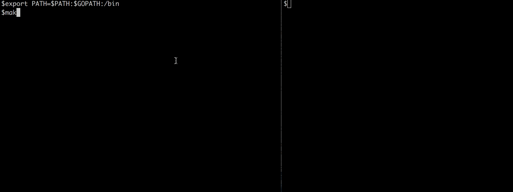

Streaming RPC's using gRPC
--------------------------

gRPC is a language-neutral, platform-neutral RPC framework that is quickly taking on JSON/HTTP
as the recommended way to communicate between microservices.

Its main selling points are:
 - Communication is based on HTTP2 transport. This provides all the advantages of the HTTP2 (compression, multiplexing, streaming)
 - Well-defined schemas via Protocol Buffers 3
 - Automatic client code generation for 10 different languages.
 - Bi-directional streaming

By default, gRPC uses Protocol Buffers as the Interface Definition Language (IDL) and as its underlying message interchange format.

In this project, we'll implement a simple PrimeFactorService that returns a stream of the prime factors of the numbers passed to it
in a request.
I decided to make my gRPC server in Go and client in Python.
The cient program will read from stdin and will immediately push it to the service.

Generate gRPC code for server and client
----------------------------------------

We are going to use gRPC to generate libraries for Go and Python 3.

.. code-block:: bash

 # Python client
 $ pip3 install -U grpcio grpcio-tools
 $ python3 -m grpc_tools.protoc -I protobuf/ --python_out=. --grpc_python_out=. protobuf/primefactor.proto
 # Go
 $ protoc -I protobuf/ --go_out=plugins=grpc:protobuf/ protobuf/primefactor.proto

The first command will generate primefactor_pb2.py and primefactor_pb2_grpc.py.
The latter will generate primefactor.pb.go.

To start the server, simply run:

.. code-block:: bash

  go run server.go

You can run this client using:

.. code-block:: bash

  python3 client.py

